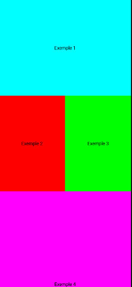

# Layouts en Jetpack Compose

Els layouts són els composables encarregats d'organitzar altres composables dins de la pantalla: quants n'hi ha, com es col·loquen (en vertical, en horitzontal, superposats...) i com es reparteix l'espai disponible entre ells. Compose n'ofereix tres de bàsics: `Box`, `Column` i `Row`, més `ConstraintLayout` per a disposicions més complexes.

Documentació oficial: https://developer.android.com/develop/ui/compose/layouts/basics

## 1. Box

`Box` és el contenidor més senzill: apila els seus fills un sobre l'altre, en l'ordre en què es declaren (el primer queda al fons, l'últim a sobre). És l'equivalent aproximat d'un `FrameLayout` en el sistema de Views, i s'utilitza sobretot per superposar elements (per exemple, un text sobre una imatge, o un indicador de càrrega sobre el contingut).

El paràmetre `contentAlignment` permet indicar com s'alineen els fills dins del `Box` (per exemple `Alignment.Center`). És important tenir en compte que aquest paràmetre només té efecte si el `Box` rep el paràmetre amb nom `content` de manera explícita, com passa quan s'utilitza la sintaxi de lambda final normal; si s'oblida o es fa servir de manera incorrecta, Compose avisarà que `contentAlignment` no té efecte.

```kotlin
@Preview(showBackground = true)
@Composable
fun Caixa() {
    val modifier: Modifier = Modifier
    Box(modifier = modifier.fillMaxSize(), contentAlignment = Alignment.Center) {
        Box(
            modifier = Modifier
                .size(50.dp)
                .background(Color.Magenta)
                .verticalScroll(
                    rememberScrollState()
                )
        ) {
            Text(" linia llarga 123 456 789 101112")
        }
    }
}
```

En aquest exemple, el `Box` exterior ocupa tota la pantalla (`fillMaxSize()`) i centra el seu contingut. El `Box` interior té una mida fixa (`50.dp`) i, com que el text que conté és més llarg del que hi cap, s'hi afegeix `verticalScroll` perquè el contingut es pugui desplaçar dins d'aquest espai limitat.

## 2. Column

`Column` distribueix els seus fills en una línia **vertical**, un a sota de l'altre. Equival a un `LinearLayout` amb orientació vertical del sistema de Views.

Atributs i conceptes clau:

- **`fillMaxSize()`** (i variants `fillMaxWidth()`, `fillMaxHeight()`): fan que la `Column` ocupi tot l'espai disponible, de manera semblant a `match_parent`.
- **`verticalArrangement`**: controla com es distribueix l'espai *sobrant* entre els fills al llarg de l'eix vertical (per exemple `Arrangement.SpaceBetween`, `Arrangement.SpaceEvenly`, `Arrangement.Center`...).
- **`horizontalAlignment`**: controla com s'alineen els fills en l'eix horitzontal (perpendicular a la direcció de la Column), per exemple `Alignment.CenterHorizontally`.
- **Pes (`weight`)**: aplicat com a modificador sobre un fill (`Modifier.weight(1f)`), determina quin percentatge de l'espai vertical restant ocupa aquell fill respecte als altres. És l'equivalent al `layout_weight` dels `LinearLayout` en XML: si dos fills tenen pes `1f` i `2f`, el segon ocuparà el doble d'espai que el primer.
- **`verticalScroll`**: si el contingut de la `Column` no cap dins de l'espai disponible, es pot afegir aquest modificador (amb `rememberScrollState()`) perquè es pugui desplaçar verticalment, en lloc de retallar-se o desbordar la pantalla.

```kotlin
Column(
    modifier = Modifier
        .fillMaxSize()
        .verticalScroll(rememberScrollState()),
    verticalArrangement = Arrangement.SpaceBetween,
    horizontalAlignment = Alignment.CenterHorizontally
) {
    Text("Element 1")
    Text("Element 2")
    Text("Element 3")
}
```

!!! warning "Barra d'estat (status bar)"
    Android exposa la mida ocupada per la barra d'estat i altres elements del sistema mitjançant els anomenats *window insets*. Si una `Column` (o qualsevol altre layout) ocupa tota la pantalla amb `fillMaxSize()`, cal aplicar aquest marge com a modificador (per exemple amb `Modifier.windowInsetsPadding` o `Modifier.safeDrawingPadding()`) perquè els primers elements no quedin amagats sota la barra d'estat.

## 3. Row

`Row` és l'anàleg horitzontal de `Column`: distribueix els seus fills en una línia **horitzontal**, un al costat de l'altre. Equival a un `LinearLayout` amb orientació horitzontal.

Els conceptes són exactament els mateixos que a `Column`, però intercanviant els eixos:

- **`horizontalArrangement`**: distribueix l'espai sobrant en l'eix horitzontal (`Arrangement.SpaceBetween`, `Arrangement.Center`...).
- **`verticalAlignment`**: alinea els fills en l'eix vertical (perpendicular), per exemple `Alignment.CenterVertically`.
- **Pes (`weight`)**: funciona igual que a `Column`, però repartint l'espai horitzontal.
- **`horizontalScroll`**: equivalent a `verticalScroll` quan el contingut no cap horitzontalment.

```kotlin
Row(
    modifier = Modifier.fillMaxWidth(),
    horizontalArrangement = Arrangement.SpaceEvenly,
    verticalAlignment = Alignment.CenterVertically
) {
    Icon(Icons.Default.Star, contentDescription = null)
    Text("Valoració")
}
```

## 4. Combinació de Row, Column i Box

A la pràctica, les interfícies reals es construeixen **niant** aquests tres layouts entre ells: una `Column` que conté diverses `Row`, dins de les quals hi ha `Box` amb icones o imatges superposades, etc. No hi ha cap límit en la profunditat d'aquest niuament, encara que per llegibilitat i rendiment és recomanable no abusar-ne i extreure els blocs repetits en composables propis.

Exemple d'exercici que combina els tres layouts:



## 5. Spacer

`Spacer` és un composable que no dibuixa res per si mateix: simplement **reserva un espai buit** dins d'un layout. S'utilitza quan es vol separar dos elements sense recórrer a `padding` o `margin`.

Com que un `Spacer` no té contingut, la seva mida s'ha d'indicar explícitament a través del `Modifier`; si no s'indica cap mida, el `Spacer` no ocupa cap espai.

```kotlin
Column {
    Text("Element 1")
    Spacer(Modifier.height(20.dp))
    Text("Element 2")
}
```

Dins d'una `Row`, el mateix `Spacer` s'utilitzaria amb `Modifier.width(...)` per reservar espai horitzontal.

## 6. ConstraintLayout

`ConstraintLayout` permet definir la posició dels composables mitjançant restriccions (*constraints*) relatives entre ells i respecte al contenidor pare, de manera semblant al `ConstraintLayout` del sistema de Views amb XML. És útil quan la disposició és massa complexa per expressar-se còmodament amb `Row`/`Column`/`Box` niats, o quan es vol evitar el cost de rendiment de tenir molts layouts imbricats.

Documentació oficial: https://developer.android.com/develop/ui/compose/layouts/constraintlayout

Cal afegir la dependència corresponent al `build.gradle` del mòdul:

```kotlin
dependencies {
    implementation("androidx.constraintlayout:constraintlayout-compose:1.1.1")
}
```

### Referències i `constrainAs`

Cada element que participa en el `ConstraintLayout` necessita una **referència**, creada amb `createRef()` (per a un sol element) o `createRefs()` (per crear-ne diverses alhora mitjançant *destructuring*). Aquesta referència es vincula al composable corresponent amb el modificador `constrainAs`, dins del qual es defineix una lambda amb les restriccions (`linkTo`) que fixen la seva posició respecte al pare o a altres elements.

En l'exemple següent, la caixa verda (`main`) queda centrada horitzontalment perquè té dues restriccions, una a l'esquerra i una a la dreta, ambdues lligades al pare. Les altres tres caixes es lliguen entre elles formant una cadena horitzontal (com els *chains* del `ConstraintLayout` en XML), creada amb `createHorizontalChain`, indicant els elements que la formen i l'estil de repartiment de l'espai (`ChainStyle`).

```kotlin
@Preview
@Composable
fun ComponentConstraint() {
    ConstraintLayout(Modifier.fillMaxSize()) {
        val main = createRef()
        // Múltiples referències alhora
        val (boxred, boxyellow, boxmagenta) = createRefs()

        Box(Modifier
            .size(100.dp).background(Color.Green).constrainAs(main) {
                top.linkTo(parent.top)
                end.linkTo(parent.end)
                start.linkTo(parent.start)
            })
        Box(Modifier
            .size(100.dp).background(Color.Yellow).constrainAs(boxyellow) {
                top.linkTo(main.bottom)
                start.linkTo(parent.start)
                end.linkTo(boxmagenta.start)
            })
        Box(Modifier
            .size(100.dp).background(Color.Magenta).constrainAs(boxmagenta) {
                top.linkTo(boxyellow.top)
                start.linkTo(boxyellow.end)
                end.linkTo(boxred.start)
            })
        Box(Modifier
            .size(100.dp).background(Color.Red).constrainAs(boxred) {
                top.linkTo(boxmagenta.top)
                start.linkTo(boxmagenta.end)
                end.linkTo(parent.end)
            })
        createHorizontalChain(boxyellow, boxmagenta, boxred, chainStyle = ChainStyle.SpreadInside)
    }
}
```

### Guies de referència

Les **guies de referència** (*guidelines*) són línies invisibles que serveixen per posicionar-hi altres elements, sense que elles mateixes es vegin. Es creen amb funcions com `createGuidelineFromTop`, `createGuidelineFromStart`, etc., indicant la posició com a fracció (per exemple `0.1f` per situar-la al 10% de l'alçada del contenidor).

```kotlin
@Preview()
@Composable
fun BoxWithGuide() {
    ConstraintLayout(Modifier.fillMaxSize().background(Color.White)) {
        val box = createRef()
        val guide = createGuidelineFromTop(0.1f)
        Box(Modifier.size(100.dp).background(Color.Red).constrainAs(box) {
            top.linkTo(guide)
        })
    }
}
```

En aquest exemple, la caixa vermella queda situada de manera que la seva vora superior toca la guia, la qual es troba al 10% de l'alçada total de la pantalla.
