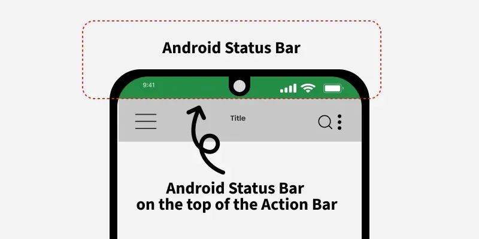

# Appbar
Documentació oficial:
https://developer.android.com/develop/ui/views/components/appbar
## 1. Concepte i funció

Originalment coneguda com a Action Bar, aquesta barra estava estretament lligada a la temàtica de l'activitat. 
Va ser la solució estàndard per a la barra d'aplicacions abans de la introducció del widget Toolbar (introduït formalment a Android 5.0 Lollipop i el Support Library).

Amb l'arribada de Material Design, es va evolucionar al component Toolbar, oferint molta més flexibilitat en estil, posicionament i funcionalitats. Avui, quan parlem d'AppBar, generalment ens referim a una Toolbar configurada a la part superior de la pantalla.

En aquest tema només parlarem de la appbar predefinida pel sistema. Si es vol personalitzar, s'ha d'utilitzar una toolbar.

La Appbar no s'ha de confondre amb la status bar.

Status bar | Appbar
:---------:|:--------:
| 

### Limitacions

La raó principal per la qual es va promoure la Toolbar és la falta de flexibilitat de l'Action Bar per defecte.

Característica	| Action Bar (Per Defecte)	| Toolbar (Widget Manual)
:---------------|:--------------------------|:-------------------
Posicionament	|Sempre fixada a la part superior de la finestra de l'Activity.	|Es pot col·locar a qualsevol lloc del disseny (part inferior, central, etc.).
Integració amb Scroll	|No es coordina amb el contingut desplaçable (no es pot col·lapsar).|Integració nativa amb CoordinatorLayout per a efectes de col·lapsament.
Contingut Personalitzat|	Molt limitat. Només permet canviar el text/icona.	| Es poden afegir widgets personalitzats (camps de cerca, imatges, etc.) directament al seu XML.
Gestió|	Gestionada per la finestra de l'Activity (Mètode getSupportActionBar()).|Gestionada com qualsevol altre widget de vista (findViewById()).


### Rols Principals:

- **Identitat:** Mostrar el nom de l'aplicació o de la vista actual (Títol).

- **Navegació:** Oferir un mitjà per moure's cap enrere o accedir a un calaix de navegació (Navigation Icon).

- **Accions:** Proporcionar accés ràpid a les accions més importants del context actual (Action Menu).


## 2. Implementació

L'Action Bar no es declara al fitxer XML del layout. La seva presència i estil es controlen exclusivament a través del Tema de l'aplicació.

Requisit de Tema: Per defecte, si el vostre tema hereta d'un tema que inclou una Action Bar (com ara Theme.AppCompat.Light.DarkActionBar), el sistema la dibuixarà automàticament a la part superior de l'activitat.

Temes Sense Barra: Si voleu eliminar-la (per exemple, per substituir-la per una Toolbar personalitzada), cal utilitzar un tema "Sense Action Bar", com ara:

Theme.AppCompat.NoActionBar

Theme.MaterialComponents.Light.NoActionBar

Per accedir a la appbar si es configura a través del tema, podem obtenir una referència així:

```kotlin
var toolbar= this.supportActionBar
```


## 3. Gestió de Menús (Igual que la Toolbar)

En aquest aspecte, l'Action Bar es comporta de manera idèntica a la Toolbar:

**Inflament del Menú:** El contingut de les accions es defineix en un fitxer XML de menú i s'infla mitjançant el mètode onCreateOptionsMenu().
```Kotlin
override fun onCreateOptionsMenu(menu: Menu?): Boolean {
    menuInflater.inflate(R.menu.main_menu, menu)
    return true
}
```

**Gestió de Clics:** La lògica del clic continua estant en onOptionsItemSelected(), on es gestionen tant les accions del menú com la fletxa "Amunt" (android.R.id.home).
```kotlin
override fun onOptionsItemSelected(item: MenuItem): Boolean {
        // Obtenim l'identificador de l'ítem clicat
        return when (item.itemId) {
            ...
        }
}
```
**Gestió dels elements del menú:**

Quan l'usuari fa click i s'ha de mostrar el menú, podem aprofitar per habilitar o deshabilitar algun element. 
```kotlin
//Quan l'usuari fa click
override fun onPrepareOptionsMenu(menu: Menu?): Boolean {
    if (true){
        var item=menu?.findItem(R.id.profile_nav_home)
       item?.setEnabled(false)
        Log.i("Toolbaronly_prepareoptionsmenu",item?.title.toString())
    }
    return super.onPrepareOptionsMenu(menu)
}
```

## 4. Gestió de la appbar amb els temes

La appbar per defecte, es mostra o no en funció del tema que estigui aplicat a l'activity:

**Tema amb appbar:**
```xml
    <style name="Base.Theme.LaMevaApp" parent="Theme.Material3.DayNight.DarkActionBar">
        <!-- Customize your dark theme here. -->
        <!-- <item name="colorPrimary">@color/my_dark_primary</item> -->
    </style>
```
**Tema sense appbar:**
```xml
    <style name="Base.Theme.LaMevaApp" parent="Theme.Material3.DayNight.NoActionBar">
        <!-- Customize your dark theme here. -->
        <!-- <item name="colorPrimary">@color/my_dark_primary</item> -->
    </style>
```

### Personalització d'activities amb o sense appbar.

Podem definir un conjunt de temes coherent que permeti que algunes de les teves activitats tinguin una barra d'aplicació i altres no, tot utilitzant els mateixos colors de marca.

#### **Tema Base de l'Aplicació**

Primer, crea un **tema base** al teu fitxer themes.xml que contingui tots els teus colors, tipografies i estils personalitzats. 

També definim el **tema de l'aplicació**  Aquest serà el tema principal de la teva aplicació. (Theme.MyCustomApp)
(Cal definir també els colors a colors.xml)

Tant el tema base com el de l'aplicació tenen appbar (hereten de DarkActionBar)

```XML
<resources xmlns:tools="http://schemas.android.com/tools">

    <style name="Base.Theme.MyCustomApp" parent="Theme.MaterialComponents.DayNight.DarkActionBar">
        <item name="colorPrimary">@color/my_primary_color</item>
        <item name="colorSecondary">@color/my_secondary_color</item>
        <item name="android:textColorPrimary">@color/my_text_primary</item>
        </style>
    <style name="Theme.MyCustomApp" parent="Base.Theme.MyCustomApp">

</resources>
```
Aquest serà el tema per defecte de l’aplicació (amb AppBar).​

A AndroidManifest.xml, aplica’l a l’<application>:

 ```xml
<application
    ...
    android:theme="@style/Theme.MyCustomApp">
    ...
 ```
Això fa que totes les activities usin aquest tema, excepte les que el sobreescriguin.​


#### Tema fill sense AppBar
Crea un tema que hereti del base però desactivi la barra d’acció (ideal per pantalles fullscreen, login, splash, etc.):

```xml
<style name="Theme.MyCustomApp.NoActionBar" parent="Theme.MyCustomApp">
    <item name="windowNoTitle">true</item>
    <item name="windowActionBar">false</item>
</style>
```
Així es mantenen tots els colors i estils del tema de l'aplicació, però sense AppBar.​

#### Assignar tema per Activity
Al AndroidManifest.xml pots dir quines activities porten appbar (tema base) i quines no (tema sense barra):

```xml
<application
    ...
    android:theme="@style/Theme.MyCustomApp">

    <!-- Activity amb AppBar (usa el tema base) -->
    <activity
        android:name=".MainActivity" />

    <!-- Activity sense AppBar -->
    <activity
        android:name=".LoginActivity"
        android:theme="@style/Theme.MyCustomApp.NoActionBar" />

    <!-- Activity amb AppBar personalitzada -->
    <activity
        android:name=".DetailsActivity"
        android:theme="@style/Theme.MyCustomApp.AppBar" />
</application>
```
