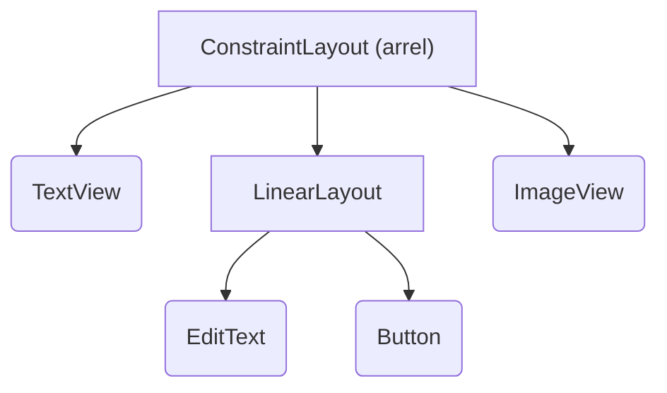

# Layouts

Un layout defineix l'estructura visual d'una pantalla: quins elements hi ha (textos, botons, imatges...) i com es col·loquen els uns respecte als altres. En el sistema de Views, els layouts es declaren normalment en fitxers XML, separats del codi Kotlin, i després es carreguen des d'una Activity o un Fragment.

Aquest document recull els conceptes comuns a tots els layouts. Els dos layouts més utilitzats tenen el seu propi document:

- [LinearLayout](./linearlayout.md)
- [ConstraintLayout i Chains](./constraintlayout.md)

Documentació oficial: [https://developer.android.com/develop/ui/views/layout/declaring-layout](https://developer.android.com/develop/ui/views/layout/declaring-layout)

## 1. View i ViewGroup

Tots els elements d'una interfície amb Views són objectes de dues classes base:

- **`View`**: un element que es dibuixa a la pantalla i amb el qual l'usuari pot interactuar. Per exemple `TextView`, `Button`, `ImageView` o `EditText`.
- **`ViewGroup`**: un contenidor invisible que conté altres `View` (o altres `ViewGroup`) i decideix on es col·loquen. Els layouts (`LinearLayout`, `ConstraintLayout`, `FrameLayout`...) són subclasses de `ViewGroup`.

Això forma una **jerarquia de vistes** en forma d'arbre: un `ViewGroup` arrel que conté fills, que al seu torn poden ser altres `ViewGroup` amb més fills.



Els rectangles són `ViewGroup` (contenen altres vistes) i els rectangles arrodonits són `View` (elements finals, sense fills).

## 2. Fitxers de layout

Els layouts es guarden a la carpeta `res/layout/` del projecte, amb noms en minúscules i guions baixos (per exemple `activity_main.xml`, `fragment_login.xml`, `item_producte.xml`).

Un fitxer de layout té **un únic element arrel**, que ha de declarar el namespace `android`:

```xml
<?xml version="1.0" encoding="utf-8"?>
<androidx.constraintlayout.widget.ConstraintLayout
    xmlns:android="http://schemas.android.com/apk/res/android"
    xmlns:app="http://schemas.android.com/apk/res-auto"
    xmlns:tools="http://schemas.android.com/tools"
    android:id="@+id/main"
    android:layout_width="match_parent"
    android:layout_height="match_parent"
    tools:context=".MainActivity">

</androidx.constraintlayout.widget.ConstraintLayout>
```

A més de `android`, sovint apareixen dos namespaces més:

- **`app:`**: atributs definits per llibreries (AndroidX, Material...) i no pel sistema. Per exemple, tots els atributs de `ConstraintLayout` (`app:layout_constraintTop_toTopOf`...).
- **`tools:`**: atributs que només fa servir l'editor d'Android Studio i que **no arriben a l'aplicació**. Per exemple, `tools:text="Nom d'exemple"` mostra un text a la vista de disseny sense posar-lo al layout real.

### Carregar el layout des de l'Activity

L'Activity carrega el layout amb `setContentView()`, indicant-li el recurs del layout (`R.layout.nom_del_fitxer`). Un cop carregat, es pot obtenir qualsevol vista a partir del seu `id` amb `findViewById()`:

```kotlin
class MainActivity : AppCompatActivity() {

    override fun onCreate(savedInstanceState: Bundle?) {
        super.onCreate(savedInstanceState)
        setContentView(R.layout.activity_main)

        val txtTitol = findViewById<TextView>(R.id.txtTitol)
        txtTitol.text = "Benvinguts"
    }
}
```

!!! warning "Cridar `findViewById()` després de `setContentView()`"
    `findViewById()` busca la vista dins del layout que s'ha carregat. Si es crida abans de `setContentView()`, encara no hi ha cap layout i retorna `null`, cosa que provoca un error en executar l'app.

!!! info "Edge-to-edge"
    Les plantilles noves d'Android Studio criden `enableEdgeToEdge()` i apliquen uns paddings a la vista arrel (amb `id` `main`) perquè el contingut no quedi sota les barres del sistema. Vegeu [Edge-to-edge i System Bars](./layoutactivities.md).

## 3. Atributs comuns

### Identificador (`id`)

L'atribut `android:id` dona un nom a la vista per poder-hi accedir des del codi (amb ViewBinding o `findViewById`) i perquè altres vistes s'hi puguin referenciar (per exemple, en un `ConstraintLayout`).

```xml
android:id="@+id/btnEnviar"
```

El `+` indica que es crea un identificador nou. Quan es fa referència a un `id` ja existent, s'escriu sense el `+`: `@id/btnEnviar`.

### Amplada i alçada

Totes les vistes **han de tenir** `android:layout_width` i `android:layout_height`. Els valors possibles són:

| Valor | Significat |
|---|---|
| `match_parent` | La vista ocupa tot l'espai disponible del pare en aquella dimensió. |
| `wrap_content` | La vista ocupa només l'espai que necessita el seu contingut. |
| `120dp` | Mida fixa. |
| `0dp` | Mida calculada pel pare: amb pesos al `LinearLayout` o amb restriccions al `ConstraintLayout`. |

### Unitats de mesura

- **`dp`** (*density-independent pixels*): unitat per a mides, marges i paddings. Un `dp` ocupa aproximadament el mateix espai físic en qualsevol pantalla, independentment de la seva densitat de píxels.
- **`sp`** (*scale-independent pixels*): com `dp`, però a més s'escala segons la mida de text que l'usuari ha triat a la configuració del dispositiu. S'utilitza **només per a mides de text** (`android:textSize`).
- **`px`**: píxels reals de la pantalla. No s'ha de fer servir, perquè el resultat canvia molt d'un dispositiu a un altre.

```xml
<TextView
    android:layout_width="wrap_content"
    android:layout_height="wrap_content"
    android:padding="16dp"
    android:textSize="18sp"
    android:text="Text amb mida accessible" />
```

## 4. Padding i margin

Tots dos creen espai, però en llocs diferents:

- **`padding`**: espai **interior**, entre la vora de la vista i el seu contingut. Forma part de la vista (per exemple, el color de fons també s'hi pinta).
- **`layout_margin`**: espai **exterior**, entre la vora de la vista i els elements que l'envolten. El gestiona el layout pare.

<div class="box-model">
  <div class="bm-zone bm-margin">
    <div class="bm-top"><code>layout_marginTop</code></div>
    <div class="bm-start">Start</div>
    <div class="bm-inner">
      <div class="bm-zone bm-view">
        <div class="bm-top">Vora de la vista</div>
        <div class="bm-inner">
          <div class="bm-zone bm-padding">
            <div class="bm-top"><code>paddingTop</code></div>
            <div class="bm-start">Start</div>
            <div class="bm-inner">
              <div class="bm-content">Contingut (text, imatge...)</div>
            </div>
            <div class="bm-end">End</div>
            <div class="bm-bottom"><code>paddingBottom</code></div>
          </div>
        </div>
      </div>
    </div>
    <div class="bm-end">End</div>
    <div class="bm-bottom"><code>layout_marginBottom</code></div>
  </div>
</div>

La línia contínua és la vora de la vista. Tot el que hi ha a dins (el padding i el contingut) forma part de la vista i es pinta amb el seu fons. El margin, amb la línia discontínua, queda a fora: és l'espai que el pare deixa entre aquesta vista i les del voltant.

Es poden indicar per a tots els costats alhora o per a cadascun per separat:

```xml
android:padding="16dp"
android:paddingHorizontal="16dp"
android:paddingVertical="8dp"
android:paddingStart="16dp"

android:layout_margin="8dp"
android:layout_marginTop="24dp"
android:layout_marginEnd="16dp"
```

!!! info "`start`/`end` en lloc de `left`/`right`"
    És preferible fer servir `Start` i `End` en lloc de `Left` i `Right`. En idiomes que s'escriuen de dreta a esquerra (àrab, hebreu), Android intercanvia automàticament `start` i `end`, i la interfície es veu correctament sense haver de fer cap canvi.

## 5. Atributs amb prefix `layout_`

Els atributs d'una vista es divideixen en dos grups, i el nom indica a quin pertanyen:

- **Atributs que comencen per `layout_`**: són instruccions per al **pare**. Indiquen al layout que conté la vista com l'ha de col·locar i quina mida li ha de donar. Per exemple `layout_width`, `layout_height` o `layout_margin`.
- **Atributs sense `layout_`**: són propietats de la **vista mateixa**. Per exemple `text`, `textSize`, `padding` o `background`.

Com que els atributs `layout_` els interpreta el pare, cada tipus de layout accepta els seus. `layout_weight` només té efecte dins d'un `LinearLayout`, i els atributs `layout_constraint...` només dins d'un `ConstraintLayout`. Si es posen en una vista que té un altre tipus de pare, s'ignoren.

Aquesta regla explica, per exemple, la diferència entre `layout_margin` (espai fora de la vista, el gestiona el pare) i `padding` (espai dins de la vista), o entre `layout_gravity` i `gravity` (vegeu [LinearLayout: Gravity i layout_gravity](./linearlayout.md#4-gravity-i-layout_gravity)).

## 6. Visibilitat

L'atribut `android:visibility` controla si una vista es mostra:

| Valor | Es veu? | Ocupa espai? |
|---|---|---|
| `visible` | Sí | Sí |
| `invisible` | No | Sí (deixa el forat) |
| `gone` | No | No (la resta d'elements es recol·loquen) |

Des del codi es canvia amb la propietat `visibility`, o amb les funcions d'extensió de `core-ktx`:

```kotlin
val progressBar = findViewById<ProgressBar>(R.id.progressBar)
progressBar.visibility = View.GONE

// Equivalent amb core-ktx
progressBar.isVisible = false
```

## 7. Tipus de layouts

| Layout | Ús |
|---|---|
| `LinearLayout` | Col·loca els fills en una sola fila o columna. Senzill i ideal per a formularis i llistes curtes d'elements. Vegeu [LinearLayout](./linearlayout.md). |
| `ConstraintLayout` | Posiciona cada fill amb restriccions respecte al pare o a altres vistes. Permet interfícies complexes sense niar layouts. És el layout per defecte de les plantilles d'Android Studio. Vegeu [ConstraintLayout i Chains](./constraintlayout.md). |
| `FrameLayout` | Apila els fills un sobre l'altre. S'utilitza com a contenidor d'un sol element (per exemple, per als Fragments) o per superposar vistes. |
| `ScrollView` / `NestedScrollView` | Permet desplaçar un contingut més gran que la pantalla. Només pot tenir **un fill directe** (normalment un `LinearLayout`). |
| `RelativeLayout` | Posiciona els fills respecte als altres. Està en desús: `ConstraintLayout` fa el mateix amb més possibilitats. |

Per a llistes llargues o dinàmiques no es fa servir un `ScrollView` amb molts elements, sinó un [RecyclerView](./recyclerview.md).

### Equivalències amb Jetpack Compose

| Views (XML) | Jetpack Compose |
|---|---|
| `LinearLayout` vertical | `Column` |
| `LinearLayout` horitzontal | `Row` |
| `FrameLayout` | `Box` |
| `ConstraintLayout` | `ConstraintLayout` (compose) |

Vegeu [Layouts en Jetpack Compose](./Jetpack_compose/layouts.md).

## 8. Rendiment: evitar el niuament excessiu

Cada `ViewGroup` que s'afegeix a la jerarquia s'ha de mesurar i col·locar. Si es nien molts layouts (un `LinearLayout` dins d'un altre, dins d'un altre...), la pantalla triga més a dibuixar-se, sobretot si s'utilitzen pesos (`layout_weight`), que obliguen a mesurar els fills dues vegades.

Recomanacions:

- Mantenir la jerarquia tan plana com sigui possible.
- Per a pantalles complexes, fer servir un `ConstraintLayout` en lloc de nivells de `LinearLayout`.
- Reutilitzar blocs de layout repetits (una capçalera, un peu...) definint-los en un fitxer propi i incloent-los amb `<include>`:

```xml
<include
    android:id="@+id/capcalera"
    layout="@layout/capcalera" />
```

## 9. L'editor de layouts d'Android Studio

En obrir un fitxer de layout, Android Studio ofereix tres modes (a la cantonada superior dreta):

- **Code**: només l'XML.
- **Split**: l'XML i la previsualització alhora. És el mode més recomanable per aprendre, perquè es veu l'efecte de cada atribut.
- **Design**: editor visual amb la paleta de components, l'arbre de components (*Component Tree*) i el panell d'atributs.

!!! info "Textos a `strings.xml`"
    Els textos no s'haurien d'escriure directament al layout (`android:text="Enviar"`), sinó a `res/values/strings.xml` i referenciar-los (`android:text="@string/enviar"`). Així es poden traduir a altres idiomes. Android Studio avisa d'aquest cas amb un *warning* de *hardcoded string*.
