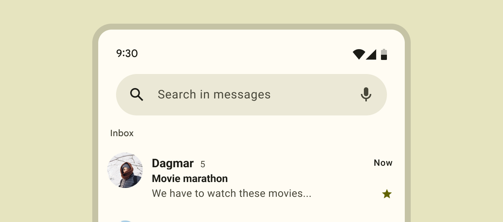

## 1. La Toolbar com a AppBar (Fonaments)
### Concepte i Funció
L'AppBar (Barra d'Aplicacions) és el component estructural més important a la part superior de qualsevol pantalla Android. 

El seu propòsit és:
- Identitat: Mostrar el títol de l'aplicació o la pantalla actual.
- Navegació: Allotjar el botó "Up" (fletxa enrere) o la icona del Navigation Drawer.
- Accions: Contenir les accions més importants de la pantalla (menús).

La Toolbar (proporcionada per la biblioteca AndroidX Material Components) és la implementació moderna i flexible de l'AppBar. A diferència de l'antiga ActionBar nativa, la Toolbar pot ser personalitzada amb facilitat.

La utilitzarem quan volguem personalitzar la appbar que apareix per defecte amb els temes.

### Implementació Bàsica
Per utilitzar una Toolbar, primer s'ha d'afegir al fitxer XML del layout de l'Activity.
Exemple: XML del Layout (activity_main.xml)
```XML
<LinearLayout 
    xmlns:android="http://schemas.android.com/apk/res/android"
    android:layout_width="match_parent"
    android:layout_height="match_parent"
    android:orientation="vertical">

    <androidx.appcompat.widget.Toolbar
        android:id="@+id/my_toolbar"
        android:layout_width="match_parent"
        android:layout_height="?attr/actionBarSize"
        android:background="?attr/colorPrimary"
        android:theme="@style/ThemeOverlay.AppCompat.Dark.ActionBar" /> 

    <TextView 
        android:layout_width="wrap_content"
        android:layout_height="wrap_content"
        android:text="El contingut de l'Activity va aquí"
        android:padding="16dp" />

</LinearLayout>
```
Després, s'ha de configurar aquesta Toolbar com l'Action Bar de l'Activity en el codi Kotlin/Java, després d'ocultar la barra nativa al tema de l'aplicació (normalment, s'usa un tema NoActionBar), amb la funció setSupportActionBar

Exemple: Configuració a l'Activity (Kotlin)
```Kotlin
import androidx.appcompat.app.AppCompatActivity

class MainActivity : AppCompatActivity() {

    override fun onCreate(savedInstanceState: Bundle?) {
        super.onCreate(savedInstanceState)
        setContentView(R.layout.activity_main)

        val toolbar = findViewById<Toolbar>(R.id.my_toolbar)
        // 1. Configura la Toolbar com l'Action Bar del sistema
        setSupportActionBar(toolbar) 
        
        // Opcional: Estableix un títol
        supportActionBar?.title = "La Meva App" 
    }
}
```

## 2. Afegir Menús a la Toolbar
### Definició del Menú
Els ítems del menú es defineixen en un fitxer XML separat a res/menu/.

Exemple: Recurs de Menú (res/menu/main_menu.xml)
```XML
<menu xmlns:android="http://schemas.android.com/apk/res/android"
    xmlns:app="http://schemas.android.com/apk/res-auto">

    <item
        android:id="@+id/action_cercar"
        android:icon="@drawable/ic_search" 
        android:title="Cercar"
        app:showAsAction="ifRoom" />

    <item
        android:id="@+id/action_configuracio"
        android:title="Configuració"
        app:showAsAction="never" />

</menu>
```
### Inflació
El procés d'inflar (carregar) el menú XML a la Toolbar es fa sobreescrivint el mètode onCreateOptionsMenu() de l'Activity.
Exemple: Inflació del Menú (Kotlin)
```Kotlin
class MainActivity : AppCompatActivity() {
    // ... onCreate ...
    
    override fun onCreateOptionsMenu(menu: Menu?): Boolean {
        // 1. Carrega el recurs de menú a l'Activity
        menuInflater.inflate(R.menu.main_menu, menu)
        return true // Retorna true per mostrar el menú
    }
    // ...
}
```

### Gestió de Clics i Prioritat

Per respondre a les interaccions de l'usuari amb els ítems del menú, s'ha de sobreescriure el mètode onOptionsItemSelected().
Exemple 2.3: Gestió de Clics (Kotlin)
```Kotlin
    // ...
    override fun onOptionsItemSelected(item: MenuItem): Boolean {
        return when (item.itemId) {
            R.id.action_cercar -> {
                // Lògica per a l'acció de cercar
                Toast.makeText(this, "S'ha premut Cerca", Toast.LENGTH_SHORT).show()
                true
            }
            R.id.action_configuracio -> {
                // Lògica per anar a Configuració
                Toast.makeText(this, "Obrint Configuració...", Toast.LENGTH_SHORT).show()
                true
            }
            else -> super.onOptionsItemSelected(item)
        }
    }
}
```
## 3. Gestió de la Navegació a l'AppBar
### El Botó "Up"
El botó "Up" (representat típicament per una fletxa cap a l'esquerra: $\leftarrow$) és una convenció de disseny que permet a l'usuari navegar cap amunt en la jerarquia lògica de l'aplicació, fins a la pantalla pare. 

És diferent del botó "Enrere" del sistema, que navega pel registre històric (back stack).

### Integració de la Navegació

Quan s'utilitza la Toolbar com a Action Bar, el sistema pot gestionar automàticament el comportament del botó "Up" basant-se en la definició de l'Activity al fitxer AndroidManifest.xml (especificant l'Activity pare amb android:parentActivityName).

Si no s'utilitza la Navigation Library, es pot habilitar el botó manualment i gestionar el seu clic:

Exemple: Habilitació del Botó "Up" (Kotlin)
```Kotlin
class DetailActivity : AppCompatActivity() {
    
    override fun onCreate(savedInstanceState: Bundle?) {
        super.onCreate(savedInstanceState)
        // ...
        
        // Habilita el botó "Up" a la Toolbar
        supportActionBar?.setDisplayHomeAsUpEnabled(true) 
    }
    
    // Gestió manual del clic al botó "Up"
    override fun onOptionsItemSelected(item: MenuItem): Boolean {
        return when (item.itemId) {
            android.R.id.home -> {
                // El mètode navigateUpFromSameTask() de l'Activity Manager 
                // compleix la funció del botó "Up"
                NavUtils.navigateUpFromSameTask(this) 
                true
            }
            else -> super.onOptionsItemSelected(item)
        }
    }
}
```
## 4. Actualització Dinàmica dels Menús
De vegades, l'estat d'un ítem de menú (p. ex., canviar una icona de "No Favorit" a "Favorit") ha de canviar mentre l'Activity està oberta.
### Invalidació del Menú
Per forçar que el sistema torni a cridar a onCreateOptionsMenu() i recreï completament el menú, s'utilitza invalidateOptionsMenu(). 

Això és útil si la visibilitat o el títol d'alguns ítems depèn d'un estat global que acaba de canviar.
Exemple: Forçar la Recreació del Menú (Kotlin)
```Kotlin
// Després d'un canvi d'estat a la nostra Activity...
fun onDataUpdated() {
    // ... 
    // Crida a invalidateOptionsMenu() per recrear el menú amb les noves dades
    invalidateOptionsMenu() 
}
```
### Preparació del Menú
El mètode onPrepareOptionsMenu() es crida just abans que es mostri el menú. Aquest és el lloc ideal per canviar la visibilitat o l'aparença dels ítems de menú existents sense recrear tota l'estructura.

Exemple: Preparació Dinàmica (Kotlin)
```Kotlin
// Variable d'estat a l'Activity
private var isUserLoggedIn = false

override fun onPrepareOptionsMenu(menu: Menu?): Boolean {
    val loginItem = menu?.findItem(R.id.action_login)
    val logoutItem = menu?.findItem(R.id.action_logout)
    
    // Mostra l'opció de login si l'usuari no està connectat, i viceversa
    loginItem?.isVisible = !isUserLoggedIn
    logoutItem?.isVisible = isUserLoggedIn
    
    return super.onPrepareOptionsMenu(menu)
}
```
## 5. Action Views
Vegeu documentació per a detalls: https://developer.android.com/develop/ui/views/components/appbar/action-views

### Action Views
Un Action View és un widget personalitzat (per exemple, un EditText, un SearchView, o un ProgressBar) que s'associa a un ítem de menú. En lloc de mostrar la icona i el text habituals, l'ítem de menú mostra el widget de l'Action View directament a la Toolbar.
Característiques:
- Widget Incrustat: El SearchView és l'exemple més comú. Quan l'usuari el selecciona, el widget s'expandeix a la barra d'aplicacions, permetent interaccions complexes (escriure, enviar) sense canviar d'Activity o mostrar un diàleg.

- Implementació: Es defineix mitjançant l'atribut app:actionViewClass o android:actionLayout a l'XML del menú. També es pot inflar manualment en el mètode onCreateOptionsMenu().

- Gestió de Col·lapse: Quan l'Action View s'expandeix, altres accions de la Toolbar es poden col·lapsar (amagar). Pots implementar la interfície MenuItem.OnActionExpandListener per gestionar esdeveniments quan l'acció s'expandeix o es col·lapsa.

Searchview sense focus     |  Searchview amb focus
:-------------------------:|:-------------------------:
 | 


## Resum de les funcion:

- onCreateOptionsMenu(): Inflar el menú
- onOptionsItemSelected(): Gestionar clics
- onPrepareOptionsMenu(): Actualitzar dinàmicament
- invalidateOptionsMenu(): Forçar recreació del menú

Utilitza AppBarLayout per a comportaments avançats (amagar/mostrar en scroll)
(veure a continuació)

## 6. Estil i Comportament Avançat (Material Design)
### Estil
L'estil de l'AppBar (colors, fons, elevació) es controla principalment a través del Tema de l'aplicació. Les propietats clau que afecten l'AppBar són:

- colorPrimary: El color de fons principal de la barra.

- colorPrimaryVariant: S'utilitza sovint per a la Barra d'Estat (Status Bar).

### Comportament Avançat amb CoordinatorLayout
Per a les aplicacions amb un disseny més sofisticat, la Toolbar s'integra amb un CoordinatorLayout i un AppBarLayout per crear efectes de desplaçament dinàmics.

#### **Exemple d'Efecte de Desplaçament:**
 Si col·loques la Toolbar dins d'un AppBarLayout i el contingut desplaçable (com un RecyclerView) també dins del CoordinatorLayout, pots utilitzar les scroll flags de l'AppBarLayout:

```XML
<androidx.coordinatorlayout.widget.CoordinatorLayout>
    <com.google.android.material.appbar.AppBarLayout
        android:layout_width="match_parent"
        android:layout_height="wrap_content">
        <androidx.appcompat.widget.Toolbar
            ...
            app:layout_scrollFlags="scroll|enterAlways" /> </com.google.android.material.appbar.AppBarLayout>

    <androidx.recyclerview.widget.RecyclerView
        ...
        app:layout_behavior="@string/appbar_scrolling_view_behavior" />
</androidx.coordinatorlayout.widget.CoordinatorLayout>
```

**scroll:**
Fa que la barra es mogui fora de la pantalla quan l'usuari es desplaça cap avall.

**enterAlways:**
 Fa que la barra torni a aparèixer tan aviat com l'usuari comença a desplaçar-se cap amunt, fins i tot lleugerament.