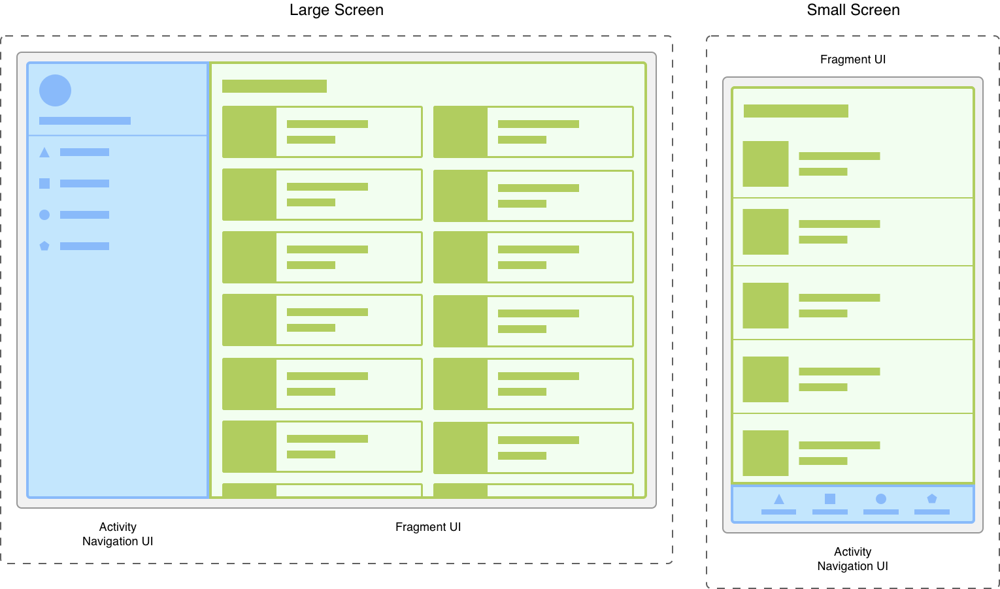
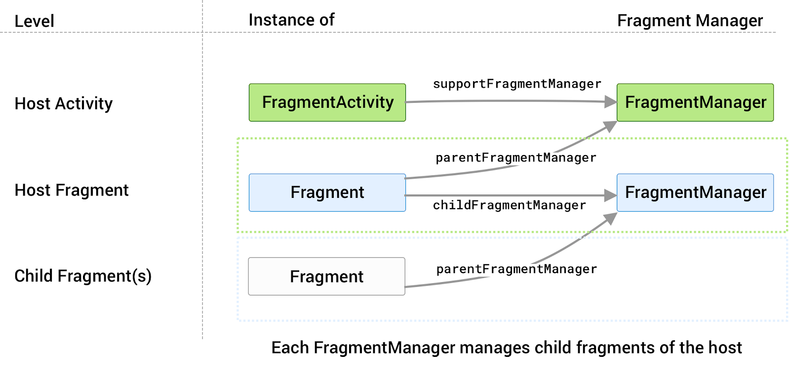

# Fragments
Documentació oficial

- https://developer.android.com/guide/fragments

Exemple pas a pas
- https://cursokotlin.com/capitulo-22-fragments-en-kotlin/


## 1-Introducció als Fragments Què són i per què utilitzar-los?

Definició: Components reutilitzables d'UI que representen una part d'una pantalla dins d'una Activity. Cada fragment té el seu cicle de vida. Han d'existir dins d'una activity o d'un altre fragment.

Avantatges:

- Reutilització: El mateix fragment pot usar-se en múltiples activities.

- Disseny adaptable: Diferents layouts per mòbils/tablets.

- Modularitat: Divideix la UI en components independents.

- Comparació: Els fragments són com "sub-activitats" amb cicle de vida propi.

Mostra visual d'una activity amb 2 fragments:


## 2-Anatomia d'un Fragment

### Estructura bàsica

Els fragments tenen layouts igual que les activities, en xml.

També tenen la seva classe Fragment() de la qual herata i sobreescriu mètodes clau:
```kolin
class NewFragment : Fragment() {

    override fun onCreate(savedInstanceState: Bundle?) {
        super.onCreate(savedInstanceState)
    }

    override fun onCreateView(
        inflater: LayoutInflater, container: ViewGroup?,
        savedInstanceState: Bundle?
    ): View? {
        // Inflate the layout for this fragment
        return inflater.inflate(R.layout.fragment_blank, container, false)
    }
    override fun onViewCreated(view: View, savedInstanceState: Bundle?) {
        val someInt = requireArguments().getInt("some_int")
        ...
    }    
```

### Mètodes essencials:

- onCreateView(): Infla el layout i retorna la View.

- onViewCreated(): Configura les vistes un cop creades.


### Cicle de vida del Fragment


Punt important: onDestroyView() es crida abans que onDestroy(), alliberant la vista.

Referència: Cicle de vida dels Fragments: https://developer.android.com/guide/fragments/lifecycle

## 3-Implementació Bàsica
### Afegir fragments a una Activity

Mètode estàtic: Via XML amb etiqueta (per fragments fixos).
```xml
<androidx.fragment.app.FragmentContainerView
    xmlns:android="http://schemas.android.com/apk/res/android"
    android:id="@+id/fragmentContainerView"
    android:layout_width="match_parent"
    android:layout_height="match_parent" />
```
Mètode dinàmic: Via FragmentManager i FragmentTransaction (més flexible).

### FragmentManager i FragmentTransaction
 Referències: https://developer.android.com/guide/fragments/fragmentmanager

El fragmentmanager és la classe responsable d'afegir, eliminar i la resta d'accions sobre un fragment.
Al fragmentmanager hi accedim des de l'activity a través de la funció supportFragmentManager.

Des del fragment, podem accedir al fragmentmanager de la app, amb la funció getParentFragmentManager().



### Afegir fragment a un fragmentcontainer

Hi ha 2 maneres de carregar un fragment, afegint-lo a l'stack, o reemplaçant-lo.

- **BackStack:** Permet tornar enrrere per tota la pila (stack) de fragments afegits.
- **Replace:** Substitueix la pila anterior per un altre. Només es pot tornar al fragment substituit.


```kotlin
    //Afegeix el fragment i l'afegeix a la pila (backstack)
    // de manera que tornar enrrere, tornara al fragment anterior.
    private fun addFragment(fragment: Fragment,args : Bundle?) {
        fragment.arguments = args
        val fragmentTransaction = supportFragmentManager.beginTransaction()
        fragmentTransaction.add(R.id.fragmentbottom, fragment)
        fragmentTransaction.addToBackStack(null)
        fragmentTransaction.commit()
    }
    //Intercanvia el fragment. Tornar enrrere no tornara al fragment anterior.
    private fun replaceFragment(fragment: Fragment,args : Bundle?){
        fragment.arguments = args
        val fragmentTransaction = supportFragmentManager.beginTransaction()
        fragmentTransaction.replace(R.id.fragmentbottom, fragment)
        fragmentTransaction.commit()
    }
```

Amb la versió més moderna (segons la documentació de android).

Cal afegir les dependiencies:
```kotlin
dependencies {
    implementation "androidx.fragment:fragment-ktx:1.6.2"
    // o la versió més recent disponible
}
```

i el codi es transforma en el següent:

```kotlin
private fun addFragment(fragment: Fragment, args: Bundle?) {
    supportFragmentManager.commit {
        setReorderingAllowed(true)
        add(R.id.fragmentbottom, fragment::class.java, args)
        addToBackStack(null)
    }
}
```

## 4-Comunicació
### Accedir a l'Activity des del Fragment

De vegades necessitem accedir a l'activity, per exemple si necessitem modificar la appbar o toolbar.

```kotlin
// Forma segura - llança excepció si no hi ha activity
val activity = requireActivity()

// Forma nullable - retorna null si no hi ha activity  
val activity = activity

// Modificar Toolbar
(requireActivity() as AppCompatActivity).supportActionBar?.title = "Nou Títol"
```

### Patró de Callbacks
```kotlin
class ExempleFragment : Fragment() {

    interface OnDataListener {
        fun onDataReceived(data: String)
    }

    private var callback: OnDatatListener? = null

    override fun onAttach(context: Context) {
        super.onAttach(context)
        if (context is OnDataListener) {
            callback = context
        } else {
            throw RuntimeException("$context must implement OnDataListener")
        }
    }

    override fun onDetach() {
        super.onDetach()
        callback = null
    }

    // Exemple: algú prem un botó al fragment
    private fun enviarDades() {
        callback?.onDataReceived("Hola des del fragment!")
    }
}

class MainActivity : AppCompatActivity(), ExempleFragment.OnDataListener {

    override fun onDataReceived(data: String) {
        // Fer alguna cosa amb les dades rebudes
        Log.d("MainActivity", data)
    }
}
```
Avantatge: Desacobla el fragment de l'activity específica.

### Amb shared Viewmodels

Vegeu documentació a [Shared Viewmodels](./Arquitectura/viewmodel.md)

## 5-Animació de les transicions entre fragments

Podem definir les animacions a la carpeta res/anim (tipus anim)

Arxius:

fade_out.xml
```
<!-- res/anim/fade_out.xml -->
<?xml version="1.0" encoding="utf-8"?>
<alpha xmlns:android="http://schemas.android.com/apk/res/android"
    android:duration="@android:integer/config_shortAnimTime"
    android:interpolator="@android:anim/decelerate_interpolator"
    android:fromAlpha="1"
    android:toAlpha="0" />
```

fade_in.xml
```
<!-- res/anim/slide_in.xml -->
<?xml version="1.0" encoding="utf-8"?>
<translate xmlns:android="http://schemas.android.com/apk/res/android"
    android:duration="@android:integer/config_shortAnimTime"
    android:interpolator="@android:anim/decelerate_interpolator"
    android:fromXDelta="100%"
    android:toXDelta="0%" />
```
En la transacció que intercanvia els fragments

```kotlin
        fragmentTransaction.setCustomAnimations(
            R.anim.fade_out, // exit
            R.anim.fade_in, // popEnter
        )
```

### Definir la animacio en entrar o sortir en el onCreate

Es creen els arxius en la carpeta res/transition (type transition)

Arxiu fade.xml
```kotlin
<!-- res/transition/fade.xml -->
<fade xmlns:android="http://schemas.android.com/apk/res/android"
    android:duration="@android:integer/config_shortAnimTime"/>
```
Arxiu slide.xml
```kotlin
<slide xmlns:android="http://schemas.android.com/apk/res/android"
    android:duration="@android:integer/config_shortAnimTime"
    android:slideEdge="right" />
```

en els fragments:
```kotlin
class FragmentA : Fragment() {
    override fun onCreate(savedInstanceState: Bundle?) {
        super.onCreate(savedInstanceState)
        val inflater = TransitionInflater.from(requireContext())
        exitTransition = inflater.inflateTransition(R.transition.fade)
    }
}

class FragmentB : Fragment() {
    override fun onCreate(savedInstanceState: Bundle?) {
        super.onCreate(savedInstanceState)
        val inflater = TransitionInflater.from(requireContext())
        enterTransition = inflater.inflateTransition(R.transition.slide_right)
    }
}
```