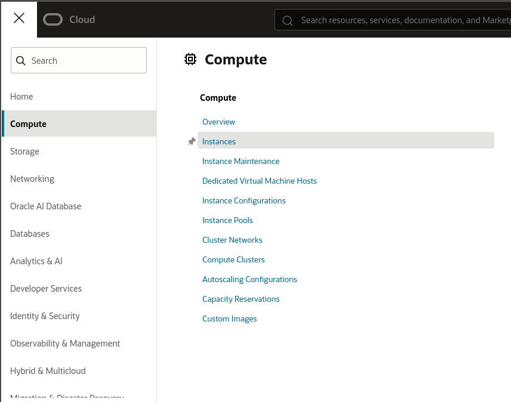
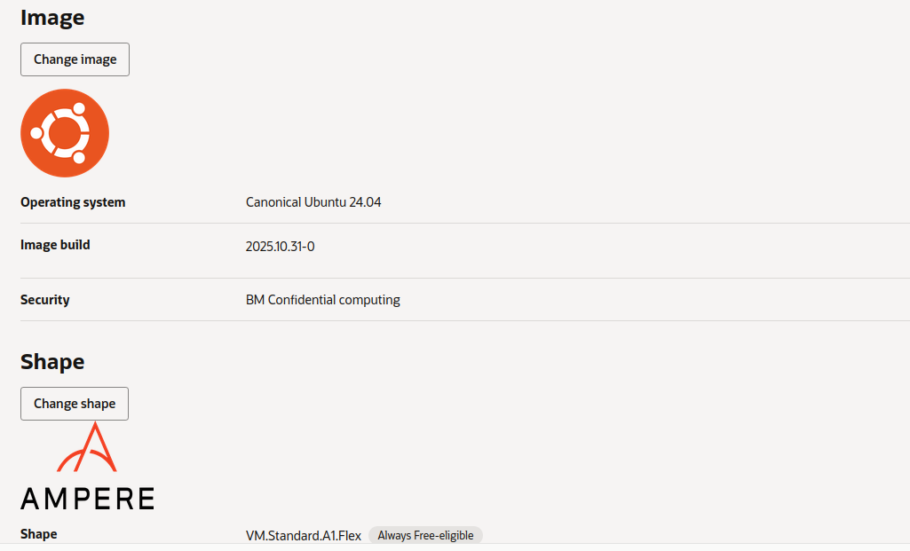
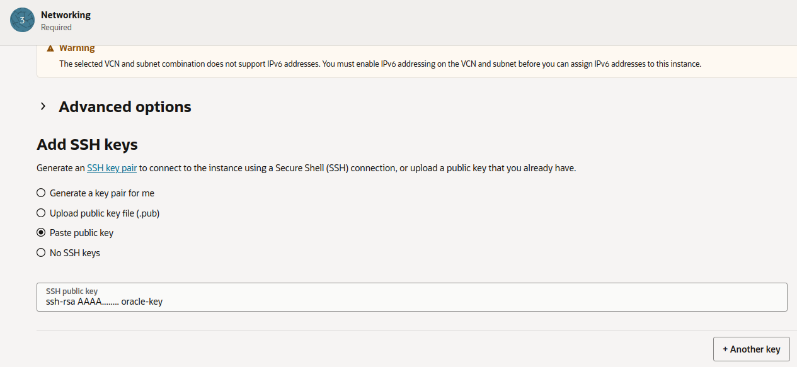
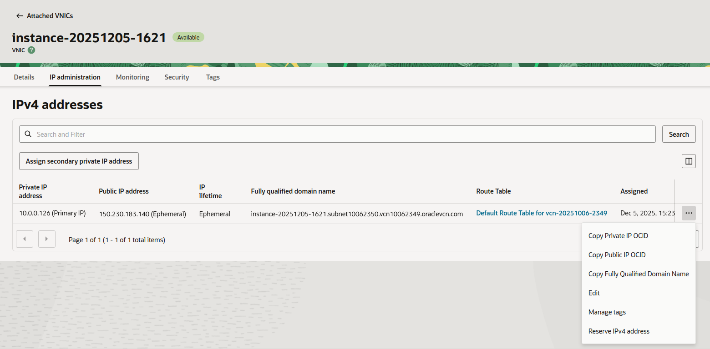

# Oracle Cloud

Operacions amb la infraestrucutra d'Oracle:

## Registre

Seguiu les instruccions que haureu rebut per email.

>[!warning]
> En cap cas poseu cap número de tarja. Amb el compte educatiu no us ho ha de demanar!!


## Crear una instància

Per crear una nova màquina virtual (instància) heu d'anar al meńu principal i buscar **Compute**->**Instances**



## Selecció del tipus d'instància

Triar image: ampere i shape: ubuntu



## Clau pública per acceidr a la instància per ssh

Per accedir per ssh, cal pujar una clau pública en el moment de crear una instància. 

Podeu obrir una clau que ja tingueu amb un editor de text i fer copiar/pegar.



Si no teniu cap clau generada, o voleu crear-ne una específicament per aquesta instància (o totes les de oracle, recomenat!!), podeu executar la següent comanda que us generarà un parell clau pública/clau privada:

> [!NOTE] 
>    Executeu aquesta comanda en la carpeta .ssh del vostre home dir

> [!WARNING]
> Comproveu què fan aquestes opcions de ssh-keygen
```bash
ssh-keygen -t rsa -b 4096 -C "oracle-key" -f oracle.key -N ""
```

Aixó crearà un arxiu oracke.key, i un arxiu oracle.key.pub. Aquest últim és el que s'ha de copiar i enganxar a la instància.

## Ip publica de la instància.
Per defecte s'hauria de crear una ip publica, però si no ho fà, caldrà anar a:

Instància->Networking->Vnic_instance


Fer click a la instància vnic i:

IpAdministration->Edit



I ara sí, triar una ip Ephemereal public ip


Referència: [https://docs.oracle.com/es-ww/iaas/Content/Network/Tasks/assigning-ephemeral-public-existing-private-ip.htm](https://docs.oracle.com/es-ww/iaas/Content/Network/Tasks/assigning-ephemeral-public-existing-private-ip.htm)

## Connexió a la instància

Preneu nota de quina és la ip pública que se us donarà quan s'engegui la instància


La connexió es realitza per ssh:

```bash
ssh ubuntu@ippublica -i oracle.key
```


## Obir ports en Oracle Cloud

Per defecte les instàncies només permeten el pas del protocol ssh al port 22.

Si volem instal·lar un servei específic (com un servidor web), caldrà obrir els ports corresponents, en la infraestructura de Oracle:

Cada subnet a la qual estigui connectada una instància, tindrà el seu firewall, o "Security List"

Cal anar a la instància i buscar el seguent camí:
**Netowrk->Subnet->Security->Security List->Security Rules->Add ingress rules**

I allà afegir-ne una semblant a la del port 22.


